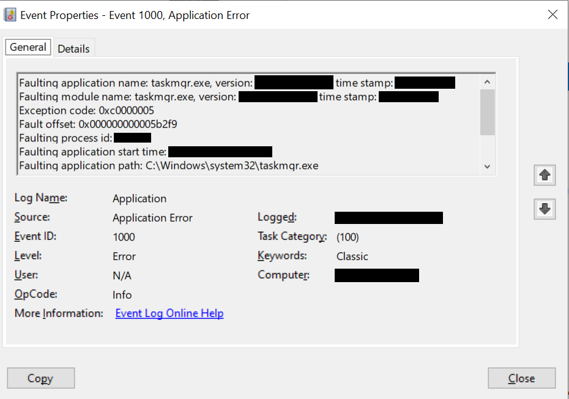
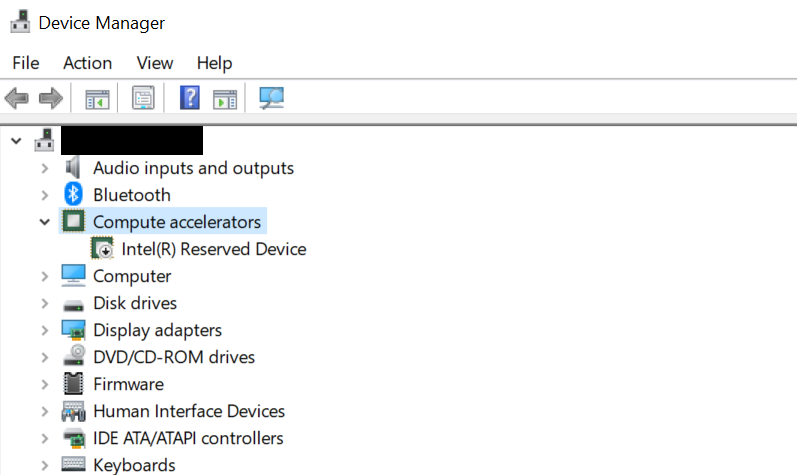

#Migrating From Intel z690 to z890 Platform - A Rocky Journey

*note:* I posted this on Reddit with the same title

Keywords: Intel Core 12th gen; Intel Core 15th gen; installation;gpt header corruption; System Repair Disk; System Image; Data Migration; boot; header checksum mismatch; boot recovery

The z890 is my second build, so I’m not exactly experienced at this. I thought I’d write up a post to share some of the hoops I needed to jump though.

Q: Why not upgrade to Win11 or start with a clean installation of the Win10 22h2 we all know and love?

A: I have made many changes to the system registry, group policy, and wrote a handful of automations and customizations that are not easily transferrable to a new system. Regarding Win11, let’s just say I have a strong objection of many things they implemented that I am not competent enough to fix. Not to say there isn’t anything nice about the new os, it’s just that I feel the quirks outweigh the conveniences.

A bit of background info: 
Previous build: Windows 10 22h2 z690 motherboard 12900ks cpu boot drive on an ssd … and I save the rest, since they’re irrelevant
New build: z890 motherboard 285k cpu … more ssds

Naive Plan: Simply install the old boot drive on the new pc and hope it boots

Procedure:
>Make a System Image and System Repair Disk of the OS running on the old hardware. (Backup, I never had to use them)

>Make a Win1022h2 boot drive

>Clean installation of Windows on the new hardware, as you would normally do

>Create another System Repair Disk (note: I used a SATA 5.25” optical drive, usb drives may have driver issues)

>Install the old boot drive in the new machine and boot

Unsurprisingly, I get this error:

“Your PC/Device needs to be repaired The header checksum for this file doesn't match the computed checksum. File: \Windows\system32\winload.efi Error code: 0xc0000221 You'll need to use recovery tools. If you don't have any installation media (like a disc or USB device), contact your PC administrator or PC/Device manufacturer.”

This is most likely because the boot procedure checks your hardware, and your hardware is significantly different than what it's registered for. "Small" changes seem to be tolerated, since I did not have this issue when swapping the 12900ks with a 13100 cpu.

To fix this, power off the system and install the SATA Optical Drive, if you haven’t already, and put in the System Repair Disk you made on your NEW system. Note you must have the disk in the Optical Drive before you restart/power on. I was able to boot into the OS after this.

I had not internet and bluetooth, which was expected since old drivers likely do not work with the new system. So:

- installed new drivers with the USB stick that came with the motherboard (Your motherboard might come with a disk containing the drivers.)

- make sure NOT to install the “Intel NPU Driver”, it will crash Task Manager if you click the “Performance” tab. If your hand slipped and installed it (like I did), go to Device Manager and disable “Intel(R) Reserved Device” under Compute Accelerators. Crashing issue fixed!

Now enjoy your cozy, tailored Win10 you’ve nurtured and shaped to your liking over the years!

I’ve been running smoothly throughout this afternoon with no issues. Other than not being able to use wifi7 and thunderbolt 5, I’m mostly satisfied.

Lastly, thanks for taking the time to read this post! I hope this helps if you find yourself in the same shoes.

###Edit1: Solving “GPT header corruption”

This is probably related to migrating the boot drive as I described above, but the first few pages of google search on this issue returned unrelated/overly complicated diagnoses and solutions. Luckily I was able to find a fix in our context, and I’d like to share it with you all.

After the first successful boot with the System Repair Disk loaded in the Optical Drive, you can safely remove the Disk for subsequent boots. Interestingly, I sometimes got a “GPT header corruption detected” error that takes me to the BIOS. I can still boot normally by selecting the boot drive from BIOS, but it was a bit of an annoyance. To fix this, go to the “Boot” panel in your bios, and go to “Boot/Boot Configuration”. Here, you should find something like “Boot Sector (MBR/GPT) Recovery Policy”. I’m using an Asus ROG Motherboard, and yours could have different wording. Mine was set to “Local User Control” as default. Set this to “Auto Recovery”, save your BIOS settings and reboot. This fixed the GPT header issue for all subsequent boots for me. After fixing the GPT header, you can revert the “Boot Sector (MBR/GPT) Recovery Policy” setting, I find it takes a significantly longer time to boot if you leave it at Auto. Also make sure to set the “Next Boot Recovery Action” to “Skip”.

Edit2: 
Issue with "Hibernate" power off

When attempting to hibernate the PC through a remote desktop session, the PC seems to have only logged off the user account, instead of going into the expected hibernation power state behavior. This was likely caused by having a mismatch between the OS level and bios power management settings. The issue was fixed easily by selecting "hibernate" on a local session. On the first try, however, the machine will reboot instead of hibernating. However, all subsequent attempt to go into this power state were successful.

Issue with "HYPERVISOE_ERROR" Blue Screen
Occurred while gaming, although the same program has been running without issue over multiple sessions for over two weeks. I am not sure of the root cause of this issue, but searching the internet the fix seemed straightforward. Run command prompt in admin mode and type in the command "bcdedit /set hypervisorlaunchtype auto". I should of checked the value of this key before setting it to auto, but let's hope this was a fix and be on lookout if this happens again in the future.

Edit 3:
UNEXPECTED_KERNEL_MODE_TRAP

Blue-screened in the middle of a remote desktop session. Ran 
>sfc /scannow

but did not find any corrupt system drivers
Try checking system boot disk and disk of main program that was running in the remote desktop session
>chkdsk 'disk letter': /f /r

In Event Viewer, the associated Event:
> BugcheckCode 127 
  BugcheckParameter1 0x8 
  BugcheckParameter2 0xfffff80780f70e70 
  BugcheckParameter3 0x80f5bad0 
  BugcheckParameter4 0xfffff80781a177a8 
  SleepInProgress 0 
  PowerButtonTimestamp 0 
  BootAppStatus 0 
  Checkpoint 0 
  ConnectedStandbyInProgress false 
  SystemSleepTransitionsToOn 1 
  CsEntryScenarioInstanceId 0 
  BugcheckInfoFromEFI false 
  CheckpointStatus 0 
  CsEntryScenarioInstanceIdV2 0 
  LongPowerButtonPressDetected false 

The above error occured again within 24hrs of doing the first step. Now try checkdisk.

All the above efforts to to resolve the powerkernel issue has failed. 7 occurrences in 7 days.
The pc went unresponsive again on 7.30 near midnight, during a remote desktop session. The last operation
was downloading sth from steam. Installed additional RAM sticks, irrelevent to this error.

Observations
1. It is now obvious the issue is more related to Remote Desktop rather than whatever programs where interacted during the session
2. The kernel power event is caused by me pressing the restart button/long pressing the power button b.c. the time frozen on system is significantly different than that logged on Event Viewer. Froze at 00:05 and logged kernel power 00:11.
3. But recently I had RD sessions as long as 5-8 hours without this issue occurring, cause of freeze still indeterminate.

Try
1. Disabling and reanabling remote desktop
2. Find the remote desktop server on host and find a way to profile (but both remote desktiop session and host machine are unresponsive)
3. Use another device to ping the host i.p. address to check liveness. If live, more likely a display driver issue
4. Try remote desktop in Safe Mode, if the feature is available